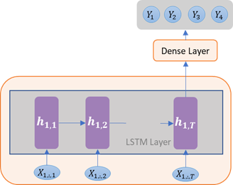
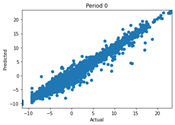
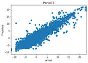
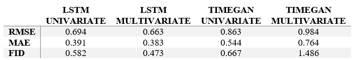

# Application of GANs to financial Time Series data

 Generative Adversarial Networks (GANs) have shown some outstanding results in the field of synthetic image generation. Following its success with image data the GAN architecture has also been applied to the time series problems, such as generating music, medical and financial data. 
 
 In this project I apply TimeGAN model to the stock price data and compare its performance to the regular Long Short Term Memory based network architecture. The project utilises data containing thousands of companies arranged in a panel data format and makes a multi-step stock price prediction for each company.

## Data
 Financial statements data was obtained from the U.S. Securities and Exchange Commission (SEC) website: https://www.sec.gov/dera/data/financial-statement-data-sets.html. The website contains a series of quarterly submissions starting from Q2 2009 to Q3 2020 (last date available at the point of data gathering). Collected data has been transformed into a panel format (one observation per company and date) excluding companies from the financial sector due to differences in accounting system. 
 Stock prices have been sourced from Yahoo Finance (Python llibrary yfinance).

## Methodology
 The models makes four steps forward forecast (four quarters).
 The number of historic time steps has been restricted to 8 quarters due to the data limitations, as some companies only have five years of observations available.
 Loss functions - combination of Binary Cross Entropy, Mean absolute and squared erros.
 Three types of activation functions are used: linear, sigmoid and tanh.
 Evaluation: The models diversity compared visually with PCA decomposition and t-SNE. Frechet Inception Distance (FID) used to measure fidelity - how close generated data follows the real time-series. Usefulness of models measured in terms of difference between generated and real data with RMSE and MAE.
 To deal with overfitting I used early stopping, dropout layers and L2 regularisation.
 Train-test split. Since we are dealing with time series data the split on the training, validation and test datasets cannot be done by selecting random observation from the data as it would break temporal dependencies in the series. Therefore, the last year of observations for each company has been selected as a test data, the year before that for validation data and all the previous years have been kept for training dataset. 

### LSTM
 The key feature of LSTM is the addition of gates that control flow of information. Gates are composed of sigmoid activation functions and pointwise multiplication operator. Sigmoid function controls how much information to let through using data from the input layer and output state of the previous cell. 
 Since the input and output sequences have different length, there are two ways of how to approach it: with vector output or using encoder-decoder format. The figure below (left) illustrates vector output when the last hidden state of the LSTM layer is passed to the Dense layer, which outputs a vector of required size directly. When autoencoder is used, encoder outputs the last state of the LSTM layer which represents the encoded states of the input data. This vector is repeated to match required output dimensions and fed into decoder, right figure. Decoder then recovers the encoded states and outputs sequence into the time distributed dense layer, which produces the final set of outputs. I'm using autoencoder to create output vector.
   

### GANs
 GAN is a framework developed in 2014 to generate realistic synthetic data. While initially it was designed for image generation the model has evolved to be applied to other areas including time series. The key feature of GANs is in having two models, generator and discriminator, competing in a zero-sum game. 
There are multiple versions of GAN adaptation to time series tasks, I'm using TimeGAN variation (by Jinsung Yoon, 2019) of GAN architecture for this project. The network architecture is shown below (taken from the original <a href="https://papers.nips.cc/paper/2019/hash/c9efe5f26cd17ba6216bbe2a7d26d490-Abstract.html">paper</a>)
 
 Some modifications to the original architecture have been made:
 - LSTM layers used in all of the TimeGAN components (embedding, recovery, generator and discriminator) with tanh activation function in the inner layers. 
 - During training the series are normally split into a fixed size batches. Given that the data consists of company specific series of varying length I've taken a different approach of varying batch size. In this version the training loop has been amended to change batch size so it only includes series from one company within a batch. It's assumed that this training set up will improve optimization as loss would be updated over more homogenous data.
 - Another modification has been made to add conditioning on additional information while learning distribution of one series. The conditioning has been added to the embedder, generator and discriminator. Unlike regular LSTM, along with condition data, such as historic series, TimeGAN also uses array of real data for embedder, random data for generator and embedded output for discriminator. Those inputs have the same dimensions as the forecast output, four time steps in our case, while the rest of the conditional data have eight time steps. To align the dimensions and merge those inputs together I'm be using an encoder-decoder transformation to reduce dimensions of conditional data. 

## Results
 For each of the architectures, LSTM-based and TimeGAN, two models have been constructed, one using historical data only and one including all the financial and economic data that was collected. Note that dependent variable has been log transformed and all the metrics and figures are derived from the transformed variable.
  Plots below show for each model iteration: 
 - Actual vs Predicted
 - Model performance examples ('Henry Schein INC', 'Universal Electronics INC') 
 - PCA decomposition
 *Univariate LSTM*
 
 
 
 *Multivariate LSTM*
 
 
 
 *Univariate TimeGAN*
 
 
 
 *Multivariate TimeGAN*
 
 
 
 *Comparison*
 
 
 The results of TimeGAN show lower accuracy and fidelity than the outcomes obtained in the LSTM-based models. This is to be expected as accuracy is not directly targeted in the TimeGAN model optimization as it is in the LSTM networks. GAN models are generally harder to train as we have to train two competing models at the same time. Additionally, the training process was slower limiting the number of iterations attempted. As such, there is room for improvement for TimeGAN model with longer training times or other modifications to the training process. On the other hand, TimeGAN forecasts show a much wider diversity in the produced series as shown on t-SNE plots summary, with noticeably better overlap with the original data. GAN models were able to create more variation within the forecast, whereas LSTM results were more repetitive in following central tendency.

